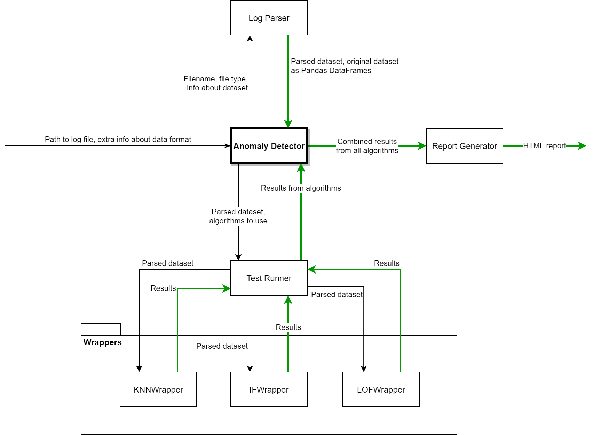

# Anomaly Detection in Log Data
In partial fulfillment for the degree of Bachelor of Science in Software Development

## Abstract
With the prevalence of businesses providing technical services offerings, there is an exponential increase in the amount of log data being generated. This log data is being underutilized due to the labour-intensive manual inspection it would require. However, businesses are hindering their opportunities given the amount of potentially insightful information about their services that could be obtained, like the health of the service and usage patterns of their clients. This information can be used to improve service offerings, the efficiency of such services, detect potentially dangerous misuse on the client side or even show service operation failure. 

The objective of this project is to demonstrate the value of anomaly detection in such log data by providing information that can be used to comprehensively improve a service. This project involves the creation of log data parsers to ensure it is suitable for data mining. The data is fed into a variety of anomaly detection algorithms for analysis. Detected anomalies are presented in the form of a report which provides actionable information to the user to assist in cause determination. This assists engineers in identifying areas of the service which require improvements or in identifying frequent failures. An accompanying benchmark tool examines the accuracy of the algorithm results, demonstrating their accuracy at detecting anomalies based on labelled anomaly datasets.

## Overview
This project is made up of multiple modules which combined provide two functionalities:
- Anomaly Detection in log data
- Benchmarking of the anomaly detection tool using labeled log files

## Usage
Anomaly Detector
```bash
python test_framework\anomaly_detector.py sample_logs\shuttle.csv -l y_1 -v 2 -o sample_results\shuttle\anomaly
```

Benchmark
```bash
python test_framework\benchmark.py sample_logs\shuttle.csv y_1 -v 2 -o sample_results\shuttle\benchmark
```

## Description
### [anomaly_detector.py](test_framework/anomaly_detector.py)
This is the main function for the anomaly detection tool. It uses the other modules to perform anomaly detection on a given dataset. 
First it uses one of the LogParser classes to read the provide dataset into a [Pandas](https://pandas.pydata.org/pandas-docs/stable/index.html) dataframe. Then it uses the TestRunner class to test the algorithms specified by the user in search for the best parameter for each algorithm. Once the parameter is chosen it runs the TestRunner with the best parameters. Finally the results are parsed using the ReportGenerator and the output is saved in the form of HTML report.

### [benchmark.py](test_framework/benchmark.py)
This is the main function for benchmarking the anomaly detection tool. Just like the anomaly detection tool it uses the LogParser to read in the dataset. It runs the tests for each algorithm and collects multiple metrics based on the results for each parameter used. The data collected is passed to the ReportGenerator which outputs the metrics in the form of a HTML report.

### [log_parser.py](test_framework/log_parser.py)
This module is responsible for parsing of log files from multiple formats. It uses [Pandas](https://pandas.pydata.org/pandas-docs/stable/index.html) for reading in files in multiple formats into a DataFrame object which can be used for anomaly detection. The LogParser class provides a template for each specific parser class and also the method used for parsing which is the same for all parser classes.

### [report_generator.py](test_framework/report_generator.py)
This module is responsible for generating the HTML reports for both anomaly detection and benchmarking. It reads the data provided by both tools and applies some formatting to the data to make it readable. For the benchmark it is also used to generate graphs by providing data to matplotlib.

### [test_runner.py](test_framework/test_runner.py)
This module is responsible for running tests on the algorithms provided. It gathers metrics about each algorithm and each parameter used and makes a decision on the best parameter to use based on this data. The TestRunner uses the algorithms provided in the wrappers module.

### [wrappers.py](test_framework/wrappers.py)
This module is used to provide anomaly detection algorithms to the other modules. It uses [Scikit-Learn](https://scikit-learn.org/) and [PyOD](https://pyod.readthedocs.io/en/latest/) for each algorithm and because each library provides its functionality using different methods and outputs the wrappers are necessary to allow the tools to perform the same actions on all algorithms using the same interface.

## Architecture


